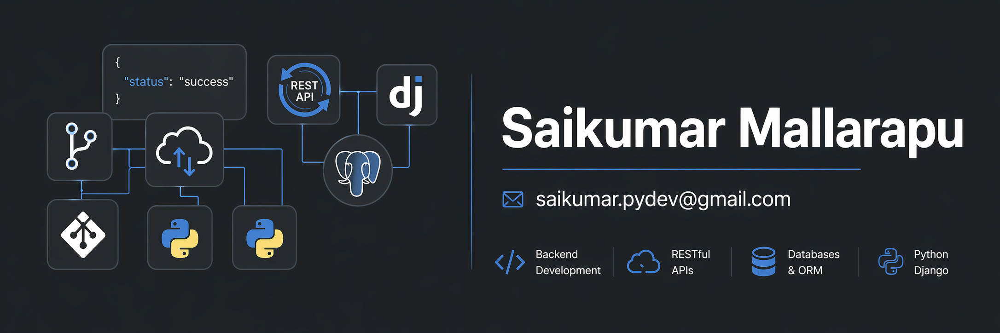

<div align="center">



</div>

---

<div align="center">

# Saikumar Mallarapu

### Python Django Developer | Backend Engineer | REST API Specialist

📍 Chennai, India &nbsp;|&nbsp; 🏢 M7 Corporation &nbsp;|&nbsp; 🎓 MCA Student

[](https://linkedin.com/in/saikumarmallarapu)
[](mailto:saikumar.pydev@gmail.com)
[](https://github.com/saikumar-thaagam)


</div>

---

## About Me

```python
developer = {
    "name"       : "Saikumar Mallarapu",
    "role"       : "Python Django Developer",
    "company"    : "M7 Corporation",
    "experience" : "1 year",
    "projects"   : "5+ production applications",
    "domains"    : ["Healthcare", "NGO", "Education"],
    "focus"      : ["REST APIs", "PostgreSQL", "Backend Systems"],
    "open_to"    : ["Django Developer", "Python Backend", "Remote"],
    "locations"  : ["Hyderabad", "Chennai", "Bengaluru"],
}
```

---

## Tech Stack

**Languages**


**Frameworks**


**Databases**


**APIs & Auth**


**Tools & DevOps**


---

## GitHub Stats

<div align="center">


</div>

---

## Certification


---

## Work Experience

**Python Django Developer** — M7 Corporation *(July 2025 – Present)*
- Built 5+ Django applications across healthcare, NGO & education domains
- Developed REST APIs using Django REST Framework with JWT & Token Auth
- Designed normalized PostgreSQL schemas with query optimization
- Deployed applications on Linux using Gunicorn + Nginx

---

<div align="center">

### Open To Work 🚀
**Django Developer | Python Backend Developer**
Hyderabad &nbsp;|&nbsp; Chennai &nbsp;|&nbsp; Bengaluru &nbsp;|&nbsp; Remote

[](https://linkedin.com/in/saikumarmallarapu)
[](mailto:saikumar.pydev@gmail.com)

</div>
