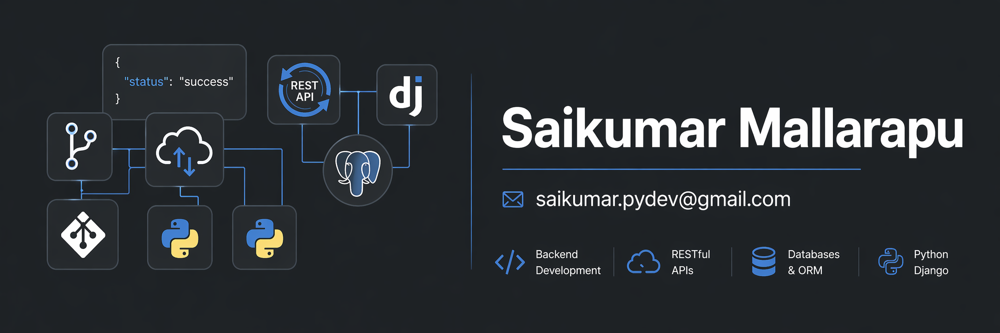

  

<h1 align="center">Saikumar Mallarapu</h1>

<h3 align="center">
Python Django Developer | Backend Developer
</h3>

Python • Django • Django REST Framework • PostgreSQL • REST APIs

  <a href="https://saikumarmallarapu.github.io">Portfolio</a>
  &nbsp; | &nbsp;
  <a href="https://linkedin.com/in/saikumarmallarapu">LinkedIn</a>
  &nbsp; | &nbsp;
  <a href="mailto:saikumar.pydev@gmail.com">Email</a>

---

## Professional Summary

Python Django Developer with 1+ year of professional experience building production web applications, REST APIs, PostgreSQL systems, automation workflows, and backend services.

Experienced in authentication, role-based access control, database design, API development, Excel and PDF processing, deployment, debugging, and production support.

Currently working at **M7 Corporation** and open to Python Developer, Django Developer, Backend Developer, and Python Backend Developer opportunities.

---

## Technical Skills

**Backend:** Python, Django, Django REST Framework, REST APIs, Celery  
**Database:** PostgreSQL, Redis  
**Authentication:** JWT, Session Authentication, RBAC  
**Automation:** openpyxl, WeasyPrint, SMTP  
**Deployment:** Linux, Gunicorn, Nginx, Docker, AWS  
**Tools:** Git, GitHub, Postman, VS Code  

---

## Professional Experience

### Python Django Developer  
**M7 Corporation**  
**July 2025 – Present**

- Build and maintain production Django applications and REST APIs
- Design PostgreSQL models and backend workflows
- Implement JWT, session authentication, and role-based access control
- Develop Excel import/export, PDF generation, email, and automation features
- Resolve production bugs and improve application performance
- Deploy applications using Linux, Gunicorn, and Nginx
- Contribute to projects across healthcare, NGO, workforce, billing, AI, and business automation

---

## Selected Projects

### Balaram Child Neuro Care  
**Independent Client Project**

Developed a multi-role healthcare management system for a client operating across three branches.

**Key features:**
- Patient management
- Therapist activities
- Progress reports
- Document management
- Announcements
- Parent-therapist communication

**Technologies:** Python, Django, Django REST Framework, PostgreSQL

---

### [Saipooja Software Solutions](https://saipoojasolutions.in)  
**Independent Project**

Developed a CRM and business automation platform for managing clients, billing, staff operations, dashboards, authentication, reporting, and REST API workflows.

**Key features:**
- Client and staff management
- Billing and invoice workflows
- Authentication and permissions
- Reporting dashboards
- REST APIs
- Business workflow automation

**Technologies:** Python, Django, PostgreSQL, REST APIs

---

### [Thaagam.org](https://thaagam.org)  
**M7 Corporation Project**

Worked on an NGO management and donation platform as a Python Django Developer at M7 Corporation.

**Key contributions:**
- Developed education and donation workflows
- Built role-based management modules
- Created campaign automation bots
- Built image quality-control tools
- Implemented inventory logic
- Developed referral donation forms
- Added Excel import and export workflows
- Supported analytics and donor campaign processes

**Technologies:** Python, Django, PostgreSQL, openpyxl

---

### GCC Workforce & Attendance System  
**M7 Corporation Project**

Worked on a workforce and attendance management platform.

**Key contributions:**
- Developed the core attendance system
- Built education and attendance dashboards
- Developed leave application and approval workflows
- Added zone, centre, and batch-based filtering
- Added Excel upload support
- Performed role-based testing and data validation

**Technologies:** Python, Django, PostgreSQL, openpyxl

---

## Education

### Master of Computer Applications  
**Shree Krishna Chaitanya Institute of Science & Technology**  
2025 – Expected 2027

### Bachelor of Computer Applications  
**Shree Krishna Chaitanya Degree College**  
2022 – 2025

---

## Certifications

### Certified Web Developer  
**NIELIT, Government of India**  
June 2025

### Python Full-Stack Workshop  
**Think Champ, AICTE Recognized**  
November 2024

---

## Current Focus

- Django performance optimization
- PostgreSQL query optimization
- REST API architecture
- Docker-based deployment
- AWS application deployment
- Backend system design

---

## Contact

**Portfolio:** https://saikumarmallarapu.github.io  
**LinkedIn:** https://linkedin.com/in/saikumarmallarapu  
**GitHub:** https://github.com/saikumarmallarapu  
**Email:** saikumar.pydev@gmail.com
